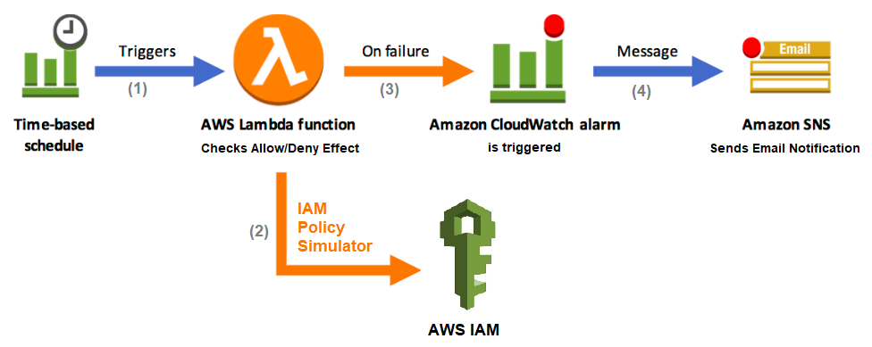

## Overview
Do you need to deploy a canary test into your AWS account to be notified when certain IAM actions do not succeed? Are you concerned about unnoticed changes to IAM permission boundaries leading to privilege abuse? Do you need to detect specific misconfigurations in AWS Organizations Service Control Policies (SCPs)?<br/>

This repository offers a Lambda function to routinely test IAM permissions using the IAM Policy Simulator API. The Lambda function demonstrates how to implement IAM canary tests to check for "Allow" and "Deny" effects by routinely simulating particular IAM actions that should be all allowed or denied.<br/> 

## Concept
Canary testing in general is a way to reduce risk. This canary test helps you detect the effect of certain actions defined in AWS IAM policies which can be overly permissive or restrictive introducing risk into your environment. The IAM Policy Simulator is used to perform a dry-run simulation by returning whether the requested actions would be allowed or denied without actually running any of the actions. The canary test implementation should trigger a failed notification when a test run programmatically raises an exception (such as an action should not be allowed) or throws an error outside the Lambda function (such as lack of access to underlying resources). To achieve this, the default error metric of Lambda function available in Amazon CloudWatch can be used to detect test run failures and trigger notifications.


## Output
The Lambda function will stop execution and throw an exception when the canary test fails for any of principal or action provided. For the IAM canary test to be effective, you need to automate both the test run and failure response. Consider triggering the Lambda function periodically, creating a CloudWatch alarm for the lambda function error metric, and configuring a notification event when the canary test fails such as an email message. <br/>

## Environment
The Lambda function has no external dependencies other than Python 3.8 and Boto3, which is the AWS Python SDK. The Lambda function requires access to action (iam:SimulatePrincipalPolicy) to run and the suggested timeout is 10 seconds.<br/>

The function must be configured with one environment variable (principals_actions_json), which is a two-level JSON structure of allowed and denied key/value pairs and a maximum of 4000 characters. The key is an Amazon Resource Name (ARN) of a user, group, or role whose policies you want to include in the test such as (arn:aws:iam::111111111111:role/MyAdmin). The value is a list of action names (service identifiers and API operations) in comma separated format to be evaluated such as (iam:CreateUser,iam:CreateAccessKey). The document below is provided as an example of the input JSON structure.
```
{
    "allowed_pairs": {
        "arn:aws:iam::111111111111:role/EC2Admin": "ec2:RunInstances,imagebuilder:CreateImagePipeline",
        "arn:aws:iam::111111111111:role/EC2Run": "ec2:RunInstances"
    },
    "denied_pairs": {
        "arn:aws:iam::111111111111:role/EC2Run": "imagebuilder:CreateImagePipeline"
    }
}
```
## Deployment
You can deployed the Lambda function via https://aws.amazon.com/cloudformation/ (using the cloudformation.yml file), https://docs.aws.amazon.com/cdk/ (using the iam-canary-cdk folder), or https://www.serverless.com/ (using the serverless.yml file). When deploying using the serverless.yml file, you need to update the principals_actions_json variable to match your requirements and also include your notification email address.<br/>

## Testing
The core logic (other than the handler method) can be tested locally without the need for Lambda deployment. I provided two files (test.py and requirements.txt) to help you install and run the IAM canary check locally. You still need to have your AWS access credentials in .aws\credentials for the test script to work. Make sure to change the test variables to match your environment. <br/>

## Cost
The total cost of the Lambda function is estimated to be less than $1 USD/month, when the Lambda and CloudWatch free usage tiers are not included.
